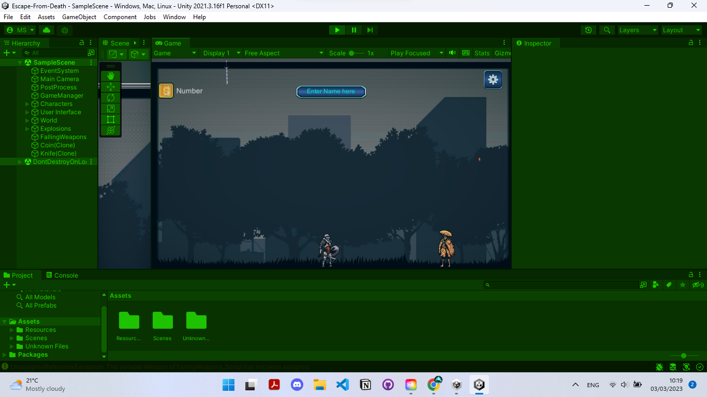

# Escape-From-Death

Welcome to the Grayvyard, were you have to run as much as you can, to Escape From Death.

This is an Open-Source Project, I started it as a University's Assignment, and I would like to share it with others, specially in a way to get it better.

In this section there is some missions I planned to accomplish in the upcoming days, but offcourse external help and contribution is really appreciated.

/\* the ninja enters the screen with a jump and says to the knight I will kill you

- the ninja plays a thunder on the screen and disappears
-
- when the weapons hit the knight,
- play hit explosion on the knight
- decrease the hearts by 1
- when the hurts over
- destroy the knight with death explosion
- play Game Over UI
-
- to make the game competetional,
- add time to the game to see who stays the most
- add leaderboard
- make the knifes quantity/second increases with time
-
- Game Over animation at the end
- \*/

//When Hit, Body.AddForce(Vector2.right)

//Missions:

//Use UI, Coroutines, Events
//Add explosion and destroy the weapon when hits the ground
//Add a special explosion when the weapon hits the knight, that decreses 1 health point
//Triple the Health points
//Add the ability to gain more health point collected hardly tell 5 points
//Add a ninja that joins every 1min and start shooting
//Add the ability to shoot the falling weapons and the ninja
//Increase the falling weapons with the increase of time to make it harder with time
//Ability to collect coins which will add a competition and leaderboard
//Organize and name the project will
//Add the ability to get donations
